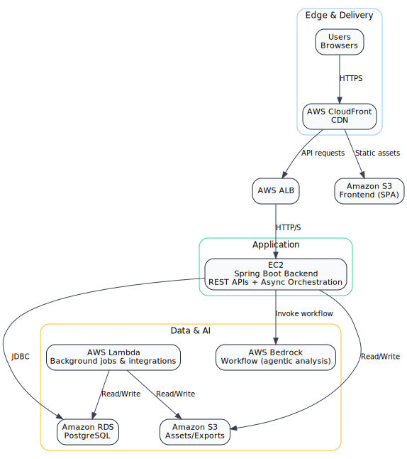

# TraderDeck Project

## Introduction
TraderDeck is a modular, cloud-native platform for AI-powered stock analysis and trading insights. It is designed to help users analyze stocks, view trading picks, and interact with intelligent agents, all powered by scalable cloud infrastructure.

## Demo: Workflow & User Experience
Explore TraderDeck's core workflows and user experience in the following demo videos:
- **Picks Tab Workflow:** See how users view, filter, and analyze stock picks generated by AI agents. [Watch Demo](https://vimeo.com/1113826343?share=copy#t=0)
- **Agents Tab Workflow:** Discover how users interact with different agents, trigger analyses, and review results. [Watch Demo](https://vimeo.com/1113826328?share=copy#t=0)

## High-Level Architecture

TraderDeck leverages AWS services (CloudFront, ALB, EC2, RDS, S3, Lambda) to deliver a robust, scalable, and secure experience. The frontend communicates with the backend via REST APIs, which orchestrate agentic analysis and interact with cloud resources.

## Repository Overview & Roles
TraderDeck is composed of four tightly integrated repositories:
- **[trader-deck-frontend: ](https://github.com/TraderDeck/trader-deck-frontend)** Modern React/Vite web application for user interaction (Picks, Agents, authentication, API integration)
- **[trader-deck-backend: ](https://github.com/TraderDeck/trader-deck-backend)** Spring Boot backend for analysis orchestration, async job management, and API endpoints
- **[trader-deck-agents: ](https://github.com/TraderDeck/trader-deck-agents)** Django-based backend for modular agent logic (fundamentals, news, orchestration), Bedrock integration, REST API
- **[trader-deck-cloud: ](https://github.com/TraderDeck/trader-deck-cloud)** Terraform IaC and AWS architecture for secure, scalable deployment (networking, security, resource provisioning)

## Application Flow
1. User interacts with the frontend (Picks, Agents tabs)
2. Frontend sends analysis requests to backend
3. Backend enqueues async jobs, orchestrates agents, and polls for results
4. Agents perform analysis (fundamentals, news, synthesis) and return structured outputs
5. Backend aggregates results and returns to frontend
6. Cloud infrastructure ensures secure, scalable, and reliable operation

## Technical Documentation
Each repository contains its own technical README and architecture notes for deeper details.
